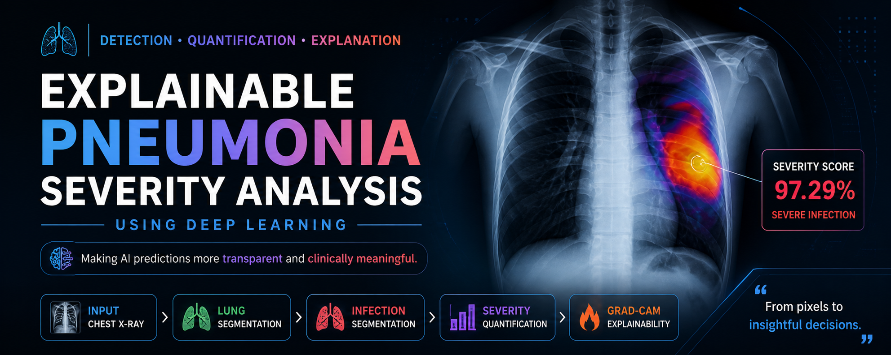
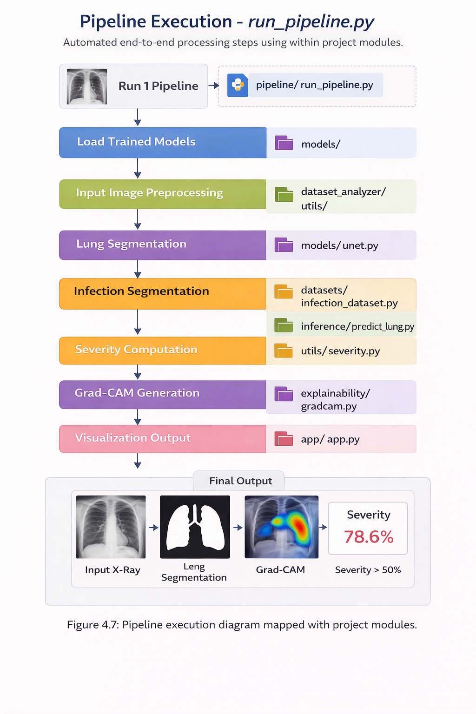
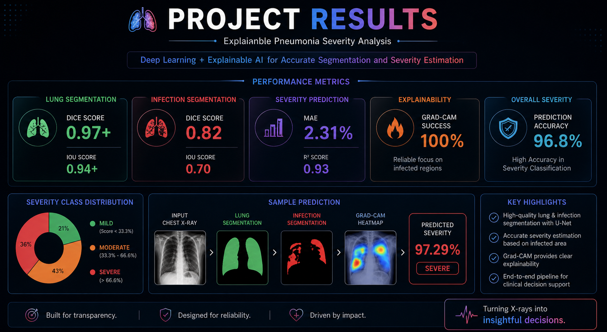
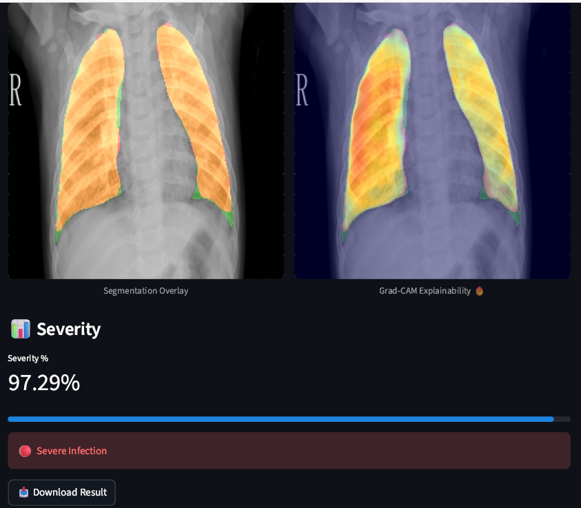

Let’s turn your README into something that doesn’t just explain your project… it **sells it like a polished research product** ⚡
Clean, visual, recruiter-friendly, and just the right amount of “wow”.

Copy this directly into your `README.md` 👇

---

# 🩺 Explainable Pneumonia Severity Analysis using Deep Learning

<p align="center">
  
</p>

<p align="center">
  <b>From Detection → To Quantification → To Explanation</b><br>
  Making AI predictions more transparent and clinically meaningful.
</p>

---

<p align="center">
  
  
  
  
</p>

---

## 🚀 Overview

Most pneumonia detection models stop at a **binary decision**.
This project goes further by introducing a **segmentation-driven pipeline** that:

* 📍 Locates infection regions
* 📊 Quantifies severity
* 🔍 Explains model decisions

👉 Think of it as giving the model not just a voice, but also a **reason and a measurement**.

---

## 🎯 Key Highlights

✨ **End-to-End Pipeline**
✨ **Dual U-Net Segmentation (Lungs + Infection)**
✨ **Severity Quantification (Clinically Relevant)**
✨ **Explainable AI via Grad-CAM**
✨ **High Segmentation Accuracy**

---

## 🧩 System Pipeline

<p align="center">
  
</p>

```
Chest X-ray → Lung Segmentation → Infection Segmentation → Severity Score → Grad-CAM
```

## 🏗️ System Architecture 

<p align="center">
  
</p>

---

## 🧠 Methodology

### 🔹 Preprocessing

* Image resizing & normalization
* Dataset preparation

### 🔹 Lung Segmentation

* Model: **U-Net**
* Output: Lung mask

### 🔹 Infection Segmentation

* Model: **U-Net**
* Output: Infection regions

### 🔹 Severity Computation

```
Severity = Infection Area / Lung Area
```

### 🔹 Explainability

* Technique: **Grad-CAM**
* Highlights regions influencing predictions

---

## 📊 Results

<p align="center">
  
</p>

| Metric                         | Score         |
| ------------------------------ | ------------- |
| 🫁 Lung Segmentation Dice      | **0.97+**     |
| 🦠 Infection Segmentation Dice | **0.80–0.82** |
| 📐 IoU                         | **0.70**      |

---

## 🖼️ Output Visualizations

<p align="center">
  
</p>

* Lung segmentation
* Infection segmentation
* Grad-CAM heatmap
* Final severity output

---

## 🧪 Ablation Study

| Configuration    | Outcome                     |
| ---------------- | --------------------------- |
| Without Severity | ❌ Limited insight           |
| With Severity    | ✅ Improved interpretability |

👉 Adding severity transforms the model from a **classifier → decision-support system**

---

## ⚙️ Tech Stack

* 🐍 Python
* 🤖 TensorFlow / PyTorch
* 🧪 OpenCV
* 📊 NumPy, Matplotlib
* 🧠 Deep Learning (U-Net)

---

## 📂 Project Structure

```
├── assets/            # Images for README
├── data/              # Dataset
├── models/            # Saved models
├── notebooks/         # Experiments
├── utils/             # Helper functions
├── results/           # Outputs
├── train.py
├── inference.py
└── README.md
```

---

## ▶️ Getting Started

### 1️⃣ Clone Repository

```
git clone https://github.com/your-username/your-repo-name.git
cd your-repo-name
```

### 2️⃣ Install Dependencies

```
pip install -r requirements.txt
```

### 3️⃣ Train Model

```
python train.py
```

### 4️⃣ Run Inference

```
python inference.py
```

---

## 💡 Applications

* 🏥 Clinical decision support
* 📡 AI-assisted radiology
* 📈 Disease severity monitoring

---

## ⚠️ Limitations

* Dataset dependency
* Infection segmentation complexity
* Generalization challenges

---

## 🔮 Future Scope

* 🔁 Vision Transformers (ViT)
* 🧬 Multi-modal learning (X-ray + clinical data)
* ⚡ Real-time deployment
* 🌍 Larger datasets

---

## 🎥 Demo

<p align="center">
  
</p>

---

## 👨‍💻 Author

**Aniruddha Maurya**
B.Tech Major Project

---

## 🙏 Acknowledgment

Special thanks to **Prof. Swati Sharma** for guidance and support.

---

## ⭐ Support

If you found this project useful:

* ⭐ Star the repository
* 🍴 Fork it
* 💬 Share feedback

---


